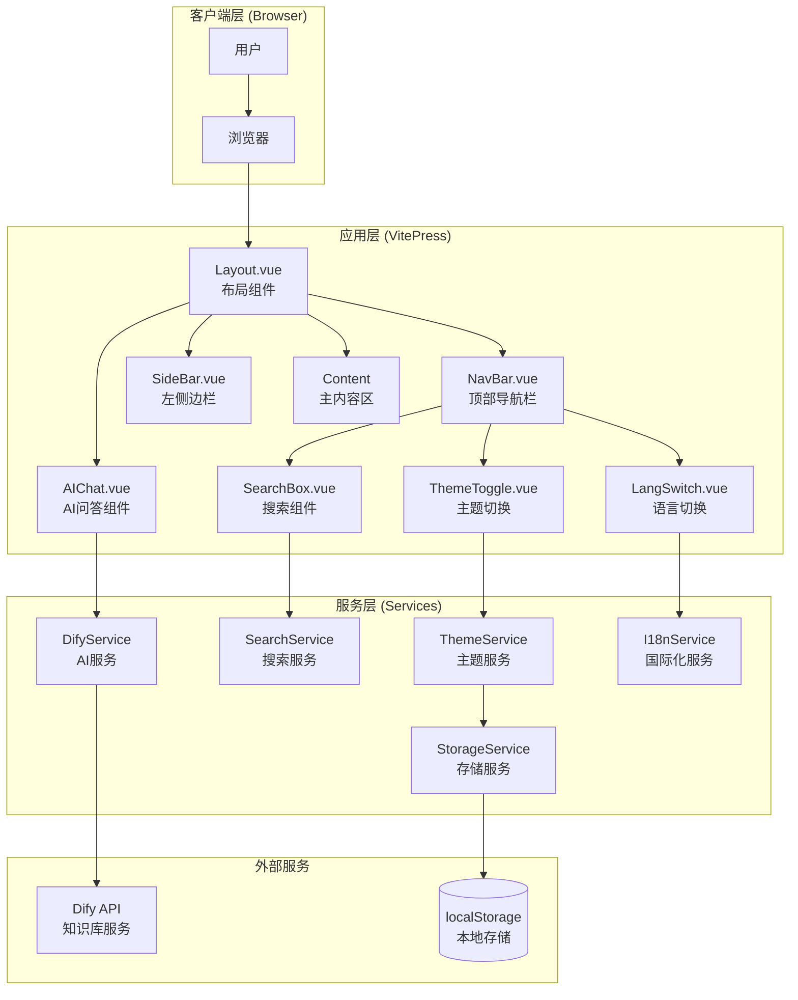
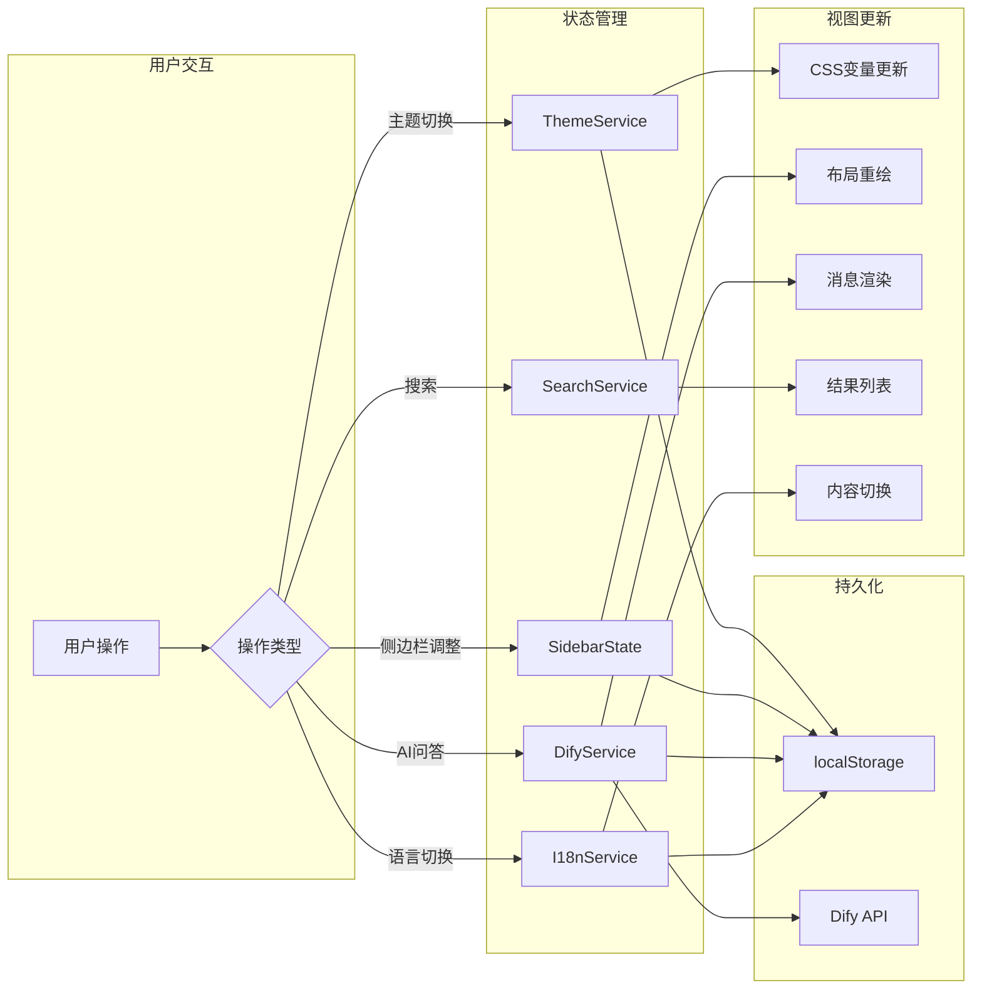
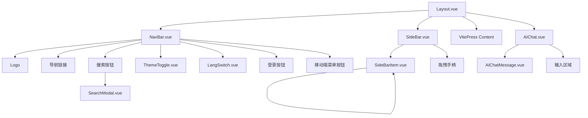
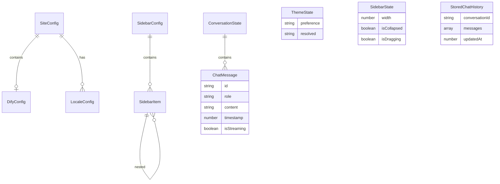
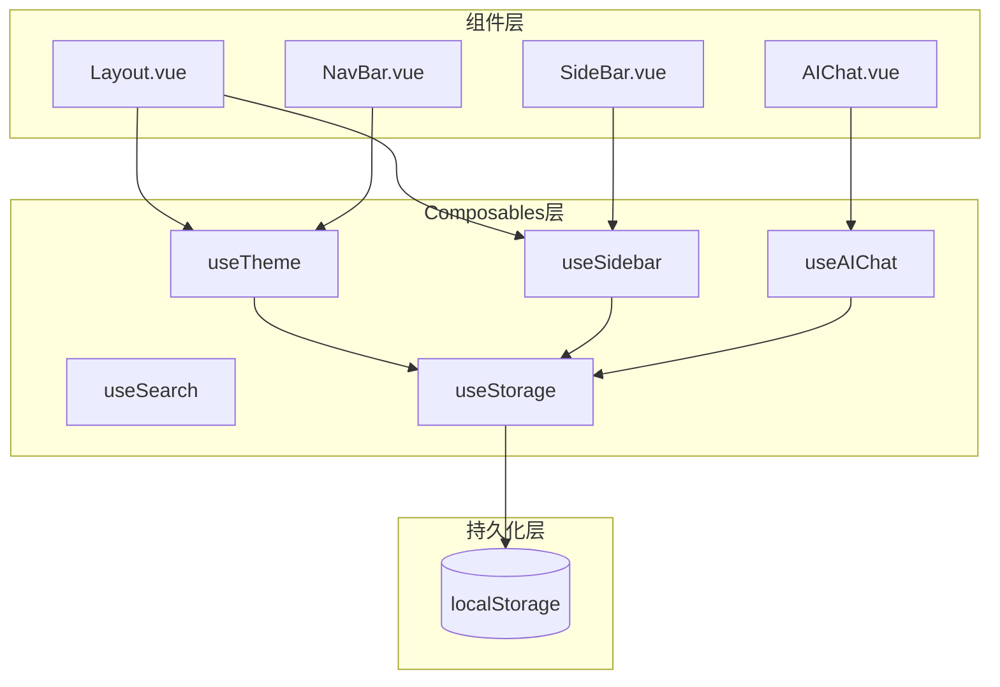
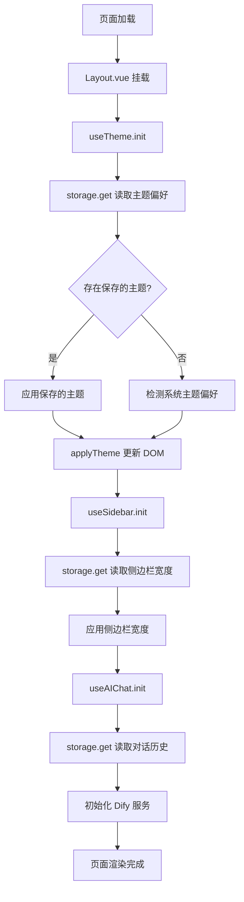
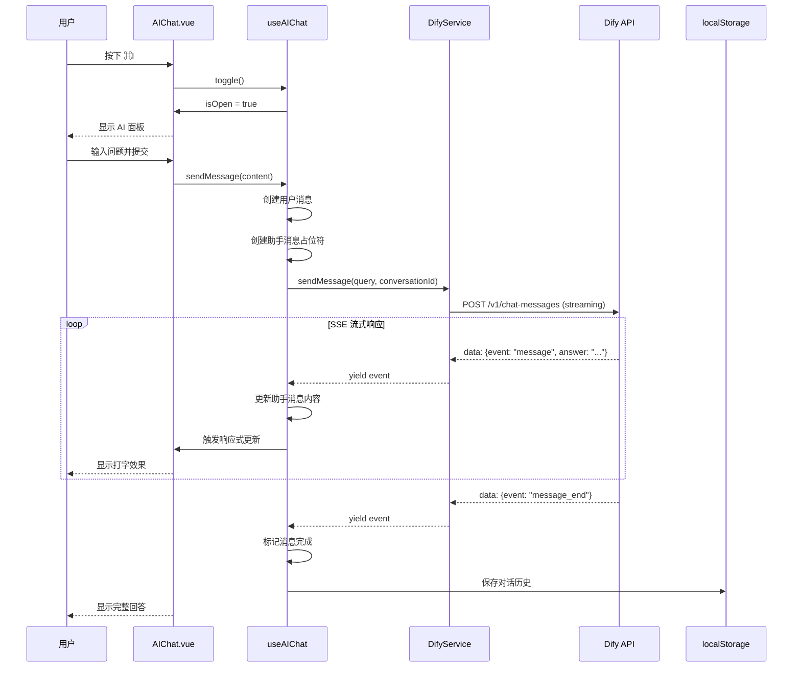
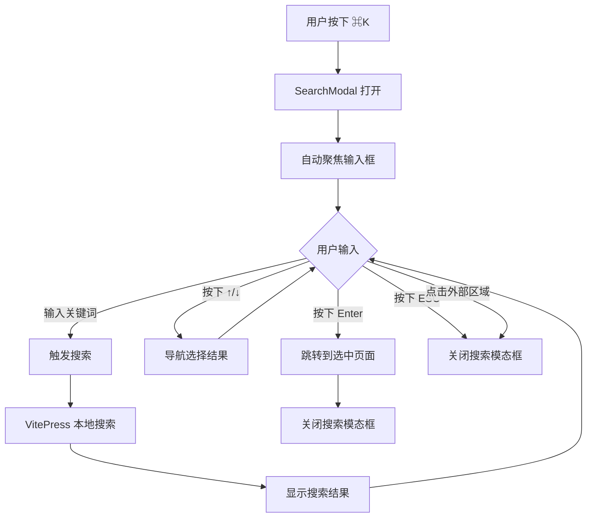
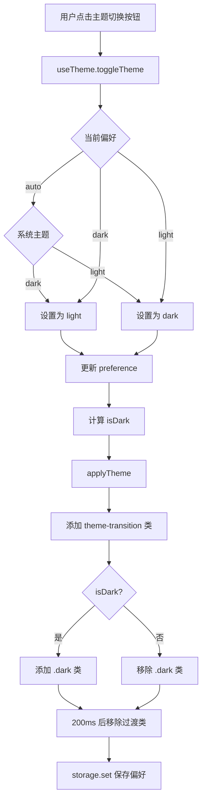

# Cursor 文档平台设计文档

## 概述

本设计文档描述了基于 VitePress 的 Cursor 风格文档平台的技术架构和实现方案。该平台旨在 1:1 复刻 Cursor 官方文档网站的页面风格和排版布局，并集成 Dify AI 知识库问答功能。

### 设计目标

1. **极简主义设计**: 采用 Cursor 官网的极简风格，细线边框、充足留白、微妙交互
2. **高性能体验**: 首屏渲染 < 3s，页面切换 < 1s，交互响应 < 100ms
3. **完整功能集成**: 包含搜索、AI 问答、深色模式、多语言支持
4. **可扩展架构**: 支持组件扩展、插件集成、配置驱动

### 技术选型

| 技术领域 | 选型 | 版本 |
|---------|------|------|
| 静态站点生成器 | VitePress | ^2.0.0 |
| 前端框架 | Vue 3 | ^3.5.0 |
| 类型系统 | TypeScript | ^5.3.3 |
| CSS 框架 | Tailwind CSS | ^4.0.0 |
| 包管理器 | pnpm | ^9.0.0 |
| AI 服务 | Dify API | - |

---

## 架构设计

### 系统架构图



### 数据流设计



### 目录结构设计

```
docs/
├── .vitepress/
│   ├── config.ts                 # VitePress 主配置
│   ├── theme/
│   │   ├── index.ts              # 主题入口
│   │   ├── Layout.vue            # 自定义布局
│   │   ├── components/
│   │   │   ├── NavBar.vue        # 顶部导航栏
│   │   │   ├── SideBar.vue       # 左侧边栏
│   │   │   ├── SideBarItem.vue   # 侧边栏项
│   │   │   ├── SearchBox.vue     # 搜索框
│   │   │   ├── SearchModal.vue   # 搜索模态框
│   │   │   ├── AIChat.vue        # AI问答面板
│   │   │   ├── AIChatMessage.vue # AI消息组件
│   │   │   ├── ThemeToggle.vue   # 主题切换
│   │   │   ├── LangSwitch.vue    # 语言切换
│   │   │   ├── MobileMenu.vue    # 移动端菜单
│   │   │   └── NotFound.vue      # 404页面
│   │   ├── composables/
│   │   │   ├── useSidebar.ts     # 侧边栏状态
│   │   │   ├── useTheme.ts       # 主题状态
│   │   │   ├── useSearch.ts      # 搜索状态
│   │   │   ├── useAIChat.ts      # AI问答状态
│   │   │   └── useStorage.ts     # 存储工具
│   │   ├── services/
│   │   │   ├── dify.ts           # Dify API 服务
│   │   │   └── storage.ts        # 本地存储服务
│   │   └── styles/
│   │       ├── vars.css          # CSS 变量定义
│   │       ├── base.css          # 基础样式
│   │       ├── layout.css        # 布局样式
│   │       ├── components.css    # 组件样式
│   │       ├── markdown.css      # Markdown 样式
│   │       └── transitions.css   # 过渡动画
│   └── cache/
├── public/
│   ├── fonts/
│   │   ├── inter/                # Inter 字体文件
│   │   └── jetbrains-mono/       # JetBrains Mono 字体
│   └── images/
│       └── logo.svg              # Logo 图片
├── zh/                           # 中文文档
├── en/                           # 英文文档
├── ja/                           # 日文文档
└── index.md                      # 首页
```

---

## 组件设计

### 组件层级关系



### 组件 1: Layout.vue

**职责**: 作为根布局组件，管理整体页面结构和全局状态

**接口定义**:

```typescript
// Layout.vue Props & Emits
interface LayoutProps {
  // 无外部 props，从 VitePress 获取数据
}

// 内部状态
interface LayoutState {
  isSidebarOpen: boolean        // 移动端侧边栏状态
  isSearchOpen: boolean         // 搜索模态框状态
  isAIChatOpen: boolean         // AI问答面板状态
  sidebarWidth: number          // 侧边栏宽度
}

// 提供给子组件的注入
interface LayoutProvide {
  toggleSidebar: () => void
  toggleSearch: () => void
  toggleAIChat: () => void
  sidebarWidth: Ref<number>
  setSidebarWidth: (width: number) => void
}
```

**模板结构**:

```vue
<template>
  <div class="layout" :class="{ 'sidebar-open': isSidebarOpen }">
    <!-- 顶部导航栏 -->
    <NavBar
      @toggle-sidebar="toggleSidebar"
      @open-search="openSearch"
    />

    <!-- 主体区域 -->
    <div class="layout-main">
      <!-- 左侧边栏 -->
      <SideBar
        v-if="hasSidebar"
        :width="sidebarWidth"
        :is-open="isSidebarOpen"
        @update:width="setSidebarWidth"
        @close="closeSidebar"
      />

      <!-- 主内容区 -->
      <main class="content-container">
        <Content />
      </main>
    </div>

    <!-- 搜索模态框 -->
    <SearchModal
      v-if="isSearchOpen"
      @close="closeSearch"
    />

    <!-- AI问答面板 -->
    <AIChat
      v-if="isAIChatOpen"
      @close="closeAIChat"
    />
  </div>
</template>
```

**依赖关系**:
- VitePress useData() 获取页面数据
- useSidebar() 管理侧边栏状态
- useTheme() 管理主题状态

---

### 组件 2: NavBar.vue

**职责**: 顶部导航栏，提供品牌展示、导航、搜索入口、主题切换等功能

**接口定义**:

```typescript
interface NavBarProps {
  // 无外部 props
}

interface NavBarEmits {
  (e: 'toggle-sidebar'): void
  (e: 'open-search'): void
}

interface NavItem {
  text: string
  link?: string
  items?: NavItem[]
  activeMatch?: string
}
```

**模板结构**:

```vue
<template>
  <header class="navbar">
    <div class="navbar-container">
      <!-- 左侧区域 -->
      <div class="navbar-left">
        <!-- 移动端菜单按钮 -->
        <button
          class="menu-button lg:hidden"
          @click="$emit('toggle-sidebar')"
          aria-label="Toggle sidebar"
        >
          <MenuIcon />
        </button>

        <!-- Logo -->
        <a href="/" class="navbar-logo">
          
          <span class="logo-text">Cursor</span>
        </a>

        <!-- 主导航 -->
        <nav class="navbar-nav hidden lg:flex">
          <template v-for="item in navItems" :key="item.text">
            <NavLink :item="item" />
          </template>
        </nav>
      </div>

      <!-- 右侧区域 -->
      <div class="navbar-right">
        <!-- 搜索按钮 -->
        <button
          class="search-button"
          @click="$emit('open-search')"
          aria-label="Search"
        >
          <SearchIcon />
          <span class="search-text hidden sm:inline">搜索</span>
          <kbd class="search-kbd hidden sm:inline">⌘K</kbd>
        </button>

        <!-- 语言切换 -->
        <LangSwitch />

        <!-- 主题切换 -->
        <ThemeToggle />

        <!-- 登录按钮 -->
        <a href="/login" class="login-button">
          登录
        </a>
      </div>
    </div>
  </header>
</template>
```

**样式规范**:
- 固定定位于页面顶部
- 高度: 48px
- 背景色: var(--c-bg)
- 底部边框: 1px solid var(--c-border)

---

### 组件 3: SideBar.vue

**职责**: 左侧边栏导航，支持树形目录、折叠展开、拖拽调整宽度

**接口定义**:

```typescript
interface SideBarProps {
  width: number                  // 侧边栏宽度
  isOpen: boolean                // 移动端打开状态
}

interface SideBarEmits {
  (e: 'update:width', width: number): void
  (e: 'close'): void
}

interface SideBarItem {
  text: string
  link?: string
  items?: SideBarItem[]
  collapsed?: boolean
}

// 拖拽状态
interface DragState {
  isDragging: boolean
  startX: number
  startWidth: number
}
```

**模板结构**:

```vue
<template>
  <!-- 移动端遮罩 -->
  <div
    v-if="isOpen"
    class="sidebar-overlay lg:hidden"
    @click="$emit('close')"
  />

  <aside
    class="sidebar"
    :class="{ 'is-open': isOpen }"
    :style="{ width: `${width}px` }"
  >
    <div class="sidebar-content">
      <nav class="sidebar-nav">
        <template v-for="group in sidebarGroups" :key="group.text">
          <SideBarGroup :group="group" />
        </template>
      </nav>
    </div>

    <!-- 拖拽手柄 -->
    <div
      class="sidebar-resize-handle"
      @mousedown="startDrag"
      @touchstart="startDrag"
    />
  </aside>
</template>
```

**拖拽逻辑**:

```typescript
// useSidebarResize.ts
export function useSidebarResize(
  initialWidth: number,
  minWidth: number = 200,
  maxWidth: number = 400
) {
  const width = ref(initialWidth)
  const isDragging = ref(false)

  const startDrag = (e: MouseEvent | TouchEvent) => {
    isDragging.value = true
    const startX = 'touches' in e ? e.touches[0].clientX : e.clientX
    const startWidth = width.value

    const onMove = (e: MouseEvent | TouchEvent) => {
      const currentX = 'touches' in e ? e.touches[0].clientX : e.clientX
      const delta = currentX - startX
      const newWidth = Math.min(maxWidth, Math.max(minWidth, startWidth + delta))
      width.value = newWidth
    }

    const onEnd = () => {
      isDragging.value = false
      document.removeEventListener('mousemove', onMove)
      document.removeEventListener('mouseup', onEnd)
      document.removeEventListener('touchmove', onMove)
      document.removeEventListener('touchend', onEnd)
      // 保存到 localStorage
      localStorage.setItem('sidebar-width', String(width.value))
    }

    document.addEventListener('mousemove', onMove)
    document.addEventListener('mouseup', onEnd)
    document.addEventListener('touchmove', onMove)
    document.addEventListener('touchend', onEnd)
  }

  return { width, isDragging, startDrag }
}
```

---

### 组件 4: SearchModal.vue

**职责**: 全屏模态搜索框，支持键盘导航、实时搜索

**接口定义**:

```typescript
interface SearchModalProps {
  // 无外部 props
}

interface SearchModalEmits {
  (e: 'close'): void
}

interface SearchResult {
  title: string
  link: string
  content: string
  matchedContent: string
}

interface SearchState {
  query: string
  results: SearchResult[]
  selectedIndex: number
  isLoading: boolean
}
```

**模板结构**:

```vue
<template>
  <Teleport to="body">
    <div class="search-modal-overlay" @click.self="$emit('close')">
      <div class="search-modal" role="dialog" aria-modal="true">
        <!-- 搜索输入框 -->
        <div class="search-input-wrapper">
          <SearchIcon class="search-icon" />
          <input
            ref="inputRef"
            v-model="query"
            type="text"
            class="search-input"
            placeholder="搜索文档..."
            @keydown.esc="$emit('close')"
            @keydown.up.prevent="selectPrev"
            @keydown.down.prevent="selectNext"
            @keydown.enter="goToSelected"
          />
          <kbd class="search-kbd">ESC</kbd>
        </div>

        <!-- 搜索结果 -->
        <div class="search-results" v-if="results.length > 0">
          <a
            v-for="(result, index) in results"
            :key="result.link"
            :href="result.link"
            class="search-result-item"
            :class="{ 'is-selected': index === selectedIndex }"
            @mouseenter="selectedIndex = index"
            @click="$emit('close')"
          >
            <div class="result-title">{{ result.title }}</div>
            <div class="result-content" v-html="result.matchedContent" />
          </a>
        </div>

        <!-- 无结果提示 -->
        <div class="search-empty" v-else-if="query && !isLoading">
          未找到相关结果
        </div>

        <!-- 初始提示 -->
        <div class="search-tips" v-else-if="!query">
          <p>输入关键词搜索文档</p>
          <div class="search-shortcuts">
            <span><kbd>↑</kbd><kbd>↓</kbd> 导航</span>
            <span><kbd>Enter</kbd> 选择</span>
            <span><kbd>ESC</kbd> 关闭</span>
          </div>
        </div>
      </div>
    </div>
  </Teleport>
</template>
```

**快捷键绑定**:

```typescript
// useSearchHotkey.ts
export function useSearchHotkey(openSearch: () => void) {
  const handleKeydown = (e: KeyboardEvent) => {
    if ((e.metaKey || e.ctrlKey) && e.key === 'k') {
      e.preventDefault()
      openSearch()
    }
  }

  onMounted(() => {
    document.addEventListener('keydown', handleKeydown)
  })

  onUnmounted(() => {
    document.removeEventListener('keydown', handleKeydown)
  })
}
```

---

### 组件 5: AIChat.vue

**职责**: AI 问答面板，集成 Dify API，支持流式响应和对话历史

**接口定义**:

```typescript
interface AIChatProps {
  // 无外部 props
}

interface AIChatEmits {
  (e: 'close'): void
}

interface ChatMessage {
  id: string
  role: 'user' | 'assistant'
  content: string
  timestamp: number
  isStreaming?: boolean
}

interface ChatState {
  messages: ChatMessage[]
  conversationId: string | null
  isLoading: boolean
  error: string | null
}
```

**模板结构**:

```vue
<template>
  <Teleport to="body">
    <!-- 遮罩层 -->
    <div class="ai-chat-overlay" @click.self="$emit('close')" />

    <!-- AI问答面板 -->
    <aside class="ai-chat-panel">
      <!-- 头部 -->
      <header class="ai-chat-header">
        <h2>AI 助手</h2>
        <div class="ai-chat-actions">
          <button @click="clearHistory" title="清空历史">
            <TrashIcon />
          </button>
          <button @click="$emit('close')" title="关闭">
            <CloseIcon />
          </button>
        </div>
      </header>

      <!-- 消息列表 -->
      <div class="ai-chat-messages" ref="messagesRef">
        <template v-if="messages.length === 0">
          <div class="ai-chat-welcome">
            <p>你好！我是 AI 助手，可以回答关于文档的问题。</p>
          </div>
        </template>

        <AIChatMessage
          v-for="message in messages"
          :key="message.id"
          :message="message"
        />

        <!-- 加载指示器 -->
        <div v-if="isLoading" class="ai-chat-loading">
          <LoadingDots />
        </div>

        <!-- 错误提示 -->
        <div v-if="error" class="ai-chat-error">
          {{ error }}
          <button @click="retry">重试</button>
        </div>
      </div>

      <!-- 输入区域 -->
      <footer class="ai-chat-footer">
        <textarea
          ref="inputRef"
          v-model="inputText"
          class="ai-chat-input"
          placeholder="输入你的问题..."
          rows="1"
          @keydown.enter.exact.prevent="sendMessage"
          @keydown.esc="$emit('close')"
        />
        <button
          class="ai-chat-send"
          :disabled="!inputText.trim() || isLoading"
          @click="sendMessage"
        >
          <SendIcon />
        </button>
      </footer>
    </aside>
  </Teleport>
</template>
```

---

### 组件 6: ThemeToggle.vue

**职责**: 主题切换按钮，支持浅色/深色模式切换

**接口定义**:

```typescript
interface ThemeToggleProps {
  // 无外部 props
}

type Theme = 'light' | 'dark' | 'auto'

interface ThemeState {
  current: Theme
  resolved: 'light' | 'dark'
}
```

**模板结构**:

```vue
<template>
  <button
    class="theme-toggle"
    :title="isDark ? '切换到浅色模式' : '切换到深色模式'"
    @click="toggleTheme"
  >
    <SunIcon v-if="isDark" class="theme-icon" />
    <MoonIcon v-else class="theme-icon" />
  </button>
</template>

<script setup lang="ts">
import { useTheme } from '../composables/useTheme'
import SunIcon from './icons/SunIcon.vue'
import MoonIcon from './icons/MoonIcon.vue'

const { isDark, toggleTheme } = useTheme()
</script>
```

---

## 数据模型

### 核心数据结构

```typescript
// types/index.ts

// ===== 配置类型 =====

/** VitePress 站点配置扩展 */
export interface SiteConfig {
  /** Dify API 配置 */
  dify?: DifyConfig
  /** 支持的语言列表 */
  locales?: LocaleConfig[]
}

/** Dify API 配置 */
export interface DifyConfig {
  /** API 基础 URL */
  apiBase: string
  /** API 密钥（从环境变量读取） */
  apiKey: string
  /** 知识库 ID */
  knowledgeBaseId?: string
}

/** 多语言配置 */
export interface LocaleConfig {
  /** 语言代码 */
  code: string
  /** 语言名称 */
  name: string
  /** 路由前缀 */
  path: string
}

// ===== 导航类型 =====

/** 导航项 */
export interface NavItem {
  text: string
  link?: string
  items?: NavItem[]
  activeMatch?: string
}

/** 侧边栏项 */
export interface SidebarItem {
  text: string
  link?: string
  items?: SidebarItem[]
  collapsed?: boolean
}

/** 侧边栏配置（按路径分组） */
export interface SidebarConfig {
  [path: string]: SidebarItem[]
}

// ===== AI 问答类型 =====

/** 聊天消息 */
export interface ChatMessage {
  /** 消息 ID */
  id: string
  /** 角色 */
  role: 'user' | 'assistant'
  /** 消息内容 */
  content: string
  /** 时间戳 */
  timestamp: number
  /** 是否正在流式输出 */
  isStreaming?: boolean
}

/** 对话状态 */
export interface ConversationState {
  /** 对话 ID */
  conversationId: string | null
  /** 消息列表 */
  messages: ChatMessage[]
  /** 是否加载中 */
  isLoading: boolean
  /** 错误信息 */
  error: string | null
}

// ===== 搜索类型 =====

/** 搜索结果 */
export interface SearchResult {
  /** 页面标题 */
  title: string
  /** 页面链接 */
  link: string
  /** 匹配内容摘要 */
  content: string
  /** 高亮后的匹配内容 */
  matchedContent: string
}

// ===== 主题类型 =====

/** 主题模式 */
export type ThemeMode = 'light' | 'dark' | 'auto'

/** 主题状态 */
export interface ThemeState {
  /** 用户选择的主题 */
  preference: ThemeMode
  /** 实际应用的主题 */
  resolved: 'light' | 'dark'
}

// ===== 布局类型 =====

/** 侧边栏状态 */
export interface SidebarState {
  /** 侧边栏宽度 */
  width: number
  /** 是否折叠（移动端） */
  isCollapsed: boolean
  /** 是否正在拖拽 */
  isDragging: boolean
}

// ===== 存储类型 =====

/** localStorage 存储键 */
export enum StorageKey {
  Theme = 'cursor-docs-theme',
  SidebarWidth = 'cursor-docs-sidebar-width',
  Language = 'cursor-docs-language',
  ChatHistory = 'cursor-docs-chat-history',
  ConversationId = 'cursor-docs-conversation-id'
}

/** 存储的聊天历史 */
export interface StoredChatHistory {
  conversationId: string
  messages: ChatMessage[]
  updatedAt: number
}
```

### 数据模型关系图



---

## API 设计

### Dify API 集成服务

```typescript
// services/dify.ts

import type { ChatMessage } from '../types'

/** Dify API 配置 */
interface DifyAPIConfig {
  apiBase: string
  apiKey: string
}

/** Dify 聊天请求参数 */
interface DifyChatRequest {
  inputs: Record<string, string>
  query: string
  response_mode: 'streaming' | 'blocking'
  conversation_id?: string
  user: string
}

/** Dify 流式响应事件 */
interface DifyStreamEvent {
  event: 'message' | 'message_end' | 'error'
  message_id?: string
  conversation_id?: string
  answer?: string
  created_at?: number
}

/**
 * Dify API 服务类
 */
export class DifyService {
  private config: DifyAPIConfig
  private abortController: AbortController | null = null

  constructor(config: DifyAPIConfig) {
    this.config = config
  }

  /**
   * 发送聊天消息（流式响应）
   */
  async *sendMessage(
    query: string,
    conversationId?: string,
    userId: string = 'anonymous'
  ): AsyncGenerator<DifyStreamEvent> {
    // 取消之前的请求
    this.abort()
    this.abortController = new AbortController()

    const response = await fetch(`${this.config.apiBase}/v1/chat-messages`, {
      method: 'POST',
      headers: {
        'Authorization': `Bearer ${this.config.apiKey}`,
        'Content-Type': 'application/json'
      },
      body: JSON.stringify({
        inputs: {},
        query,
        response_mode: 'streaming',
        conversation_id: conversationId,
        user: userId
      } as DifyChatRequest),
      signal: this.abortController.signal
    })

    if (!response.ok) {
      throw new Error(`Dify API error: ${response.status}`)
    }

    const reader = response.body?.getReader()
    if (!reader) {
      throw new Error('No response body')
    }

    const decoder = new TextDecoder()
    let buffer = ''

    try {
      while (true) {
        const { done, value } = await reader.read()
        if (done) break

        buffer += decoder.decode(value, { stream: true })
        const lines = buffer.split('\n')
        buffer = lines.pop() || ''

        for (const line of lines) {
          if (line.startsWith('data: ')) {
            const data = line.slice(6)
            if (data === '[DONE]') return

            try {
              const event: DifyStreamEvent = JSON.parse(data)
              yield event
            } catch (e) {
              console.error('Failed to parse SSE event:', e)
            }
          }
        }
      }
    } finally {
      reader.releaseLock()
    }
  }

  /**
   * 取消当前请求
   */
  abort() {
    if (this.abortController) {
      this.abortController.abort()
      this.abortController = null
    }
  }
}
```

### AI 问答 Composable

```typescript
// composables/useAIChat.ts

import { ref, computed, onMounted, onUnmounted } from 'vue'
import { DifyService } from '../services/dify'
import type { ChatMessage, ConversationState, StoredChatHistory } from '../types'
import { StorageKey } from '../types'
import { useStorage } from './useStorage'

export function useAIChat() {
  const storage = useStorage()

  // 状态
  const messages = ref<ChatMessage[]>([])
  const conversationId = ref<string | null>(null)
  const isLoading = ref(false)
  const error = ref<string | null>(null)
  const isOpen = ref(false)

  // Dify 服务实例
  let difyService: DifyService | null = null

  // 初始化
  const init = () => {
    // 从环境变量获取配置
    const apiBase = import.meta.env.VITE_DIFY_API_BASE
    const apiKey = import.meta.env.VITE_DIFY_API_KEY

    if (apiBase && apiKey) {
      difyService = new DifyService({ apiBase, apiKey })
    }

    // 加载历史记录
    loadHistory()
  }

  // 加载历史记录
  const loadHistory = () => {
    const history = storage.get<StoredChatHistory>(StorageKey.ChatHistory)
    if (history) {
      messages.value = history.messages
      conversationId.value = history.conversationId
    }
  }

  // 保存历史记录
  const saveHistory = () => {
    const history: StoredChatHistory = {
      conversationId: conversationId.value || '',
      messages: messages.value,
      updatedAt: Date.now()
    }
    storage.set(StorageKey.ChatHistory, history)
  }

  // 发送消息
  const sendMessage = async (content: string) => {
    if (!difyService || !content.trim()) return

    // 添加用户消息
    const userMessage: ChatMessage = {
      id: `user-${Date.now()}`,
      role: 'user',
      content: content.trim(),
      timestamp: Date.now()
    }
    messages.value.push(userMessage)

    // 创建助手消息占位符
    const assistantMessage: ChatMessage = {
      id: `assistant-${Date.now()}`,
      role: 'assistant',
      content: '',
      timestamp: Date.now(),
      isStreaming: true
    }
    messages.value.push(assistantMessage)

    isLoading.value = true
    error.value = null

    try {
      // 流式接收响应
      for await (const event of difyService.sendMessage(
        content,
        conversationId.value || undefined
      )) {
        if (event.event === 'message' && event.answer) {
          assistantMessage.content += event.answer
        } else if (event.event === 'message_end') {
          assistantMessage.isStreaming = false
          if (event.conversation_id) {
            conversationId.value = event.conversation_id
          }
        } else if (event.event === 'error') {
          throw new Error('AI 服务返回错误')
        }
      }

      // 保存历史记录
      saveHistory()
    } catch (e) {
      error.value = e instanceof Error ? e.message : '发送失败，请重试'
      // 移除失败的助手消息
      messages.value = messages.value.filter(m => m.id !== assistantMessage.id)
    } finally {
      isLoading.value = false
    }
  }

  // 清空历史
  const clearHistory = () => {
    messages.value = []
    conversationId.value = null
    storage.remove(StorageKey.ChatHistory)
  }

  // 重试
  const retry = () => {
    const lastUserMessage = [...messages.value]
      .reverse()
      .find(m => m.role === 'user')
    if (lastUserMessage) {
      // 移除最后一条用户消息，重新发送
      messages.value = messages.value.filter(m => m.id !== lastUserMessage.id)
      sendMessage(lastUserMessage.content)
    }
  }

  // 打开/关闭面板
  const open = () => { isOpen.value = true }
  const close = () => { isOpen.value = false }
  const toggle = () => { isOpen.value = !isOpen.value }

  // 快捷键监听
  const handleKeydown = (e: KeyboardEvent) => {
    if ((e.metaKey || e.ctrlKey) && e.key === 'i') {
      e.preventDefault()
      toggle()
    }
  }

  onMounted(() => {
    init()
    document.addEventListener('keydown', handleKeydown)
  })

  onUnmounted(() => {
    document.removeEventListener('keydown', handleKeydown)
    difyService?.abort()
  })

  return {
    // 状态
    messages,
    conversationId,
    isLoading,
    error,
    isOpen,
    // 方法
    sendMessage,
    clearHistory,
    retry,
    open,
    close,
    toggle
  }
}
```

---

## 样式系统设计

### CSS 变量定义

```css
/* styles/vars.css */

:root {
  /* ===== 颜色系统 ===== */

  /* 主色调 */
  --c-brand: #000000;
  --c-brand-light: #333333;
  --c-brand-dark: #000000;

  /* 背景色 */
  --c-bg: #ffffff;
  --c-bg-soft: #f9f9f9;
  --c-bg-mute: #f3f3f3;
  --c-bg-alt: #f5f5f5;

  /* 文字色 */
  --c-text-1: #1a1a1a;
  --c-text-2: #4a4a4a;
  --c-text-3: #8a8a8a;
  --c-text-4: #b8b8b8;

  /* 边框色 */
  --c-border: #e5e5e5;
  --c-border-dark: #d0d0d0;

  /* 交互色 */
  --c-hover: rgba(0, 0, 0, 0.05);
  --c-active: rgba(0, 0, 0, 0.08);

  /* 强调色 */
  --c-accent: #0066ff;
  --c-accent-light: #3385ff;

  /* 状态色 */
  --c-success: #10b981;
  --c-warning: #f59e0b;
  --c-error: #ef4444;

  /* ===== 尺寸系统 ===== */

  /* 导航栏 */
  --navbar-height: 48px;

  /* 侧边栏 */
  --sidebar-width: 280px;
  --sidebar-width-min: 200px;
  --sidebar-width-max: 400px;

  /* 内容区 */
  --content-max-width: 768px;
  --content-padding: 24px;

  /* AI 面板 */
  --ai-panel-width: 400px;

  /* ===== 字体系统 ===== */

  /* 字体族 */
  --font-family-base: 'Inter', -apple-system, BlinkMacSystemFont, 'Segoe UI', Roboto, sans-serif;
  --font-family-mono: 'JetBrains Mono', 'SF Mono', Monaco, 'Fira Code', monospace;

  /* 字号 */
  --font-size-xs: 12px;
  --font-size-sm: 14px;
  --font-size-base: 16px;
  --font-size-lg: 18px;
  --font-size-xl: 20px;
  --font-size-2xl: 24px;
  --font-size-3xl: 32px;
  --font-size-4xl: 36px;

  /* 行高 */
  --line-height-tight: 1.25;
  --line-height-normal: 1.5;
  --line-height-relaxed: 1.75;

  /* 字重 */
  --font-weight-normal: 400;
  --font-weight-medium: 500;
  --font-weight-semibold: 600;
  --font-weight-bold: 700;

  /* ===== 间距系统 ===== */

  --spacing-1: 4px;
  --spacing-2: 8px;
  --spacing-3: 12px;
  --spacing-4: 16px;
  --spacing-5: 20px;
  --spacing-6: 24px;
  --spacing-8: 32px;
  --spacing-10: 40px;
  --spacing-12: 48px;

  /* ===== 圆角 ===== */

  --radius-sm: 4px;
  --radius-md: 6px;
  --radius-lg: 8px;
  --radius-xl: 12px;
  --radius-full: 9999px;

  /* ===== 阴影 ===== */

  --shadow-sm: 0 1px 2px rgba(0, 0, 0, 0.05);
  --shadow-md: 0 4px 6px rgba(0, 0, 0, 0.07);
  --shadow-lg: 0 10px 15px rgba(0, 0, 0, 0.1);
  --shadow-xl: 0 20px 25px rgba(0, 0, 0, 0.15);

  /* ===== 过渡 ===== */

  --transition-fast: 0.15s ease;
  --transition-normal: 0.2s ease;
  --transition-slow: 0.3s ease;

  /* ===== Z-index ===== */

  --z-sidebar: 100;
  --z-navbar: 200;
  --z-overlay: 300;
  --z-modal: 400;
  --z-tooltip: 500;
}

/* ===== 深色模式 ===== */

.dark {
  --c-brand: #ffffff;
  --c-brand-light: #e0e0e0;
  --c-brand-dark: #ffffff;

  --c-bg: #0a0a0a;
  --c-bg-soft: #141414;
  --c-bg-mute: #1f1f1f;
  --c-bg-alt: #1a1a1a;

  --c-text-1: #f5f5f5;
  --c-text-2: #b8b8b8;
  --c-text-3: #7a7a7a;
  --c-text-4: #4a4a4a;

  --c-border: #2a2a2a;
  --c-border-dark: #3a3a3a;

  --c-hover: rgba(255, 255, 255, 0.05);
  --c-active: rgba(255, 255, 255, 0.08);

  --shadow-sm: 0 1px 2px rgba(0, 0, 0, 0.3);
  --shadow-md: 0 4px 6px rgba(0, 0, 0, 0.4);
  --shadow-lg: 0 10px 15px rgba(0, 0, 0, 0.5);
  --shadow-xl: 0 20px 25px rgba(0, 0, 0, 0.6);
}
```

### 主题切换实现

```typescript
// composables/useTheme.ts

import { ref, computed, watch, onMounted } from 'vue'
import type { ThemeMode, ThemeState } from '../types'
import { StorageKey } from '../types'
import { useStorage } from './useStorage'

export function useTheme() {
  const storage = useStorage()

  // 用户偏好
  const preference = ref<ThemeMode>('auto')

  // 系统主题
  const systemDark = ref(false)

  // 实际应用的主题
  const isDark = computed(() => {
    if (preference.value === 'auto') {
      return systemDark.value
    }
    return preference.value === 'dark'
  })

  // 切换主题
  const toggleTheme = () => {
    if (preference.value === 'auto') {
      preference.value = systemDark.value ? 'light' : 'dark'
    } else {
      preference.value = preference.value === 'dark' ? 'light' : 'dark'
    }
  }

  // 设置主题
  const setTheme = (theme: ThemeMode) => {
    preference.value = theme
  }

  // 应用主题到 DOM
  const applyTheme = () => {
    const html = document.documentElement

    // 添加过渡类
    html.classList.add('theme-transition')

    if (isDark.value) {
      html.classList.add('dark')
    } else {
      html.classList.remove('dark')
    }

    // 移除过渡类
    setTimeout(() => {
      html.classList.remove('theme-transition')
    }, 200)

    // 保存偏好
    storage.set(StorageKey.Theme, preference.value)
  }

  // 监听变化
  watch(isDark, applyTheme)

  // 初始化
  onMounted(() => {
    // 加载保存的偏好
    const saved = storage.get<ThemeMode>(StorageKey.Theme)
    if (saved) {
      preference.value = saved
    }

    // 监听系统主题变化
    const mediaQuery = window.matchMedia('(prefers-color-scheme: dark)')
    systemDark.value = mediaQuery.matches

    mediaQuery.addEventListener('change', (e) => {
      systemDark.value = e.matches
    })

    // 应用初始主题
    applyTheme()
  })

  return {
    preference,
    isDark,
    toggleTheme,
    setTheme
  }
}
```

### 过渡动画样式

```css
/* styles/transitions.css */

/* 主题切换过渡 */
.theme-transition,
.theme-transition *,
.theme-transition *::before,
.theme-transition *::after {
  transition: background-color 0.2s ease,
              border-color 0.2s ease,
              color 0.2s ease !important;
}

/* 侧边栏过渡 */
.sidebar {
  transition: transform var(--transition-normal),
              width var(--transition-fast);
}

/* 搜索模态框过渡 */
.search-modal-enter-active,
.search-modal-leave-active {
  transition: opacity var(--transition-fast);
}

.search-modal-enter-from,
.search-modal-leave-to {
  opacity: 0;
}

.search-modal-enter-active .search-modal,
.search-modal-leave-active .search-modal {
  transition: transform var(--transition-normal);
}

.search-modal-enter-from .search-modal,
.search-modal-leave-to .search-modal {
  transform: translateY(-20px);
}

/* AI 面板过渡 */
.ai-panel-enter-active,
.ai-panel-leave-active {
  transition: transform var(--transition-normal);
}

.ai-panel-enter-from,
.ai-panel-leave-to {
  transform: translateX(100%);
}

/* 悬停效果 */
.hover-effect {
  transition: background-color var(--transition-fast);
}

.hover-effect:hover {
  background-color: var(--c-hover);
}

/* 焦点效果 */
.focus-effect:focus-visible {
  outline: 2px solid var(--c-accent);
  outline-offset: 2px;
}

/* 按钮按压效果 */
.press-effect:active {
  transform: scale(0.98);
}
```

---

## 响应式布局设计

### 断点定义

```css
/* 响应式断点 */
/* sm: >= 640px  - 搜索框文本显示 */
/* md: >= 768px  - 平板布局 */
/* lg: >= 1024px - 桌面布局，侧边栏显示 */
/* xl: >= 1280px - 大屏布局 */
```

### 布局样式

```css
/* styles/layout.css */

/* ===== 根布局 ===== */

.layout {
  min-height: 100vh;
  display: flex;
  flex-direction: column;
}

.layout-main {
  display: flex;
  flex: 1;
  padding-top: var(--navbar-height);
}

/* ===== 导航栏 ===== */

.navbar {
  position: fixed;
  top: 0;
  left: 0;
  right: 0;
  height: var(--navbar-height);
  background: var(--c-bg);
  border-bottom: 1px solid var(--c-border);
  z-index: var(--z-navbar);
}

.navbar-container {
  display: flex;
  align-items: center;
  justify-content: space-between;
  height: 100%;
  padding: 0 var(--spacing-4);
  max-width: 100%;
}

.navbar-left {
  display: flex;
  align-items: center;
  gap: var(--spacing-4);
}

.navbar-right {
  display: flex;
  align-items: center;
  gap: var(--spacing-3);
}

/* ===== 侧边栏 ===== */

.sidebar {
  position: fixed;
  top: var(--navbar-height);
  left: 0;
  bottom: 0;
  width: var(--sidebar-width);
  background: var(--c-bg);
  border-right: 1px solid var(--c-border);
  overflow-y: auto;
  z-index: var(--z-sidebar);
  transform: translateX(-100%);
}

/* 桌面端显示 */
@media (min-width: 1024px) {
  .sidebar {
    transform: translateX(0);
  }
}

/* 移动端打开状态 */
.sidebar.is-open {
  transform: translateX(0);
}

.sidebar-overlay {
  position: fixed;
  inset: 0;
  background: rgba(0, 0, 0, 0.5);
  z-index: calc(var(--z-sidebar) - 1);
}

.sidebar-resize-handle {
  position: absolute;
  top: 0;
  right: 0;
  bottom: 0;
  width: 4px;
  cursor: ew-resize;
  background: transparent;
  transition: background var(--transition-fast);
}

.sidebar-resize-handle:hover,
.sidebar-resize-handle:active {
  background: var(--c-accent);
}

/* ===== 主内容区 ===== */

.content-container {
  flex: 1;
  min-width: 0;
  padding: var(--spacing-6);
}

@media (min-width: 1024px) {
  .content-container {
    margin-left: var(--sidebar-width);
  }
}

.content-wrapper {
  max-width: var(--content-max-width);
  margin: 0 auto;
}

/* ===== 搜索模态框 ===== */

.search-modal-overlay {
  position: fixed;
  inset: 0;
  background: rgba(0, 0, 0, 0.5);
  display: flex;
  align-items: flex-start;
  justify-content: center;
  padding-top: 10vh;
  z-index: var(--z-modal);
}

.search-modal {
  width: 100%;
  max-width: 600px;
  max-height: 70vh;
  background: var(--c-bg);
  border-radius: var(--radius-lg);
  box-shadow: var(--shadow-xl);
  overflow: hidden;
  display: flex;
  flex-direction: column;
}

/* 移动端全屏 */
@media (max-width: 639px) {
  .search-modal-overlay {
    padding: 0;
  }

  .search-modal {
    max-width: none;
    max-height: none;
    height: 100vh;
    border-radius: 0;
  }
}

/* ===== AI 问答面板 ===== */

.ai-chat-panel {
  position: fixed;
  top: 0;
  right: 0;
  bottom: 0;
  width: var(--ai-panel-width);
  background: var(--c-bg);
  border-left: 1px solid var(--c-border);
  display: flex;
  flex-direction: column;
  z-index: var(--z-modal);
  box-shadow: var(--shadow-xl);
}

/* 移动端全屏 */
@media (max-width: 639px) {
  .ai-chat-panel {
    width: 100%;
    border-left: none;
  }
}

.ai-chat-overlay {
  position: fixed;
  inset: 0;
  background: rgba(0, 0, 0, 0.3);
  z-index: calc(var(--z-modal) - 1);
}
```

### 响应式工具类

```css
/* 响应式显示/隐藏 */
.hidden {
  display: none;
}

@media (min-width: 640px) {
  .sm\:inline { display: inline; }
  .sm\:hidden { display: none; }
}

@media (min-width: 1024px) {
  .lg\:flex { display: flex; }
  .lg\:hidden { display: none; }
}
```

---

## 状态管理设计

### 状态管理架构



### 本地存储服务

```typescript
// composables/useStorage.ts

import { StorageKey } from '../types'

export function useStorage() {
  /**
   * 获取存储值
   */
  const get = <T>(key: StorageKey): T | null => {
    try {
      const item = localStorage.getItem(key)
      return item ? JSON.parse(item) : null
    } catch (e) {
      console.error(`Failed to get storage item: ${key}`, e)
      return null
    }
  }

  /**
   * 设置存储值
   */
  const set = <T>(key: StorageKey, value: T): boolean => {
    try {
      localStorage.setItem(key, JSON.stringify(value))
      return true
    } catch (e) {
      console.error(`Failed to set storage item: ${key}`, e)
      return false
    }
  }

  /**
   * 移除存储值
   */
  const remove = (key: StorageKey): boolean => {
    try {
      localStorage.removeItem(key)
      return true
    } catch (e) {
      console.error(`Failed to remove storage item: ${key}`, e)
      return false
    }
  }

  /**
   * 清空所有存储
   */
  const clear = (): boolean => {
    try {
      Object.values(StorageKey).forEach(key => {
        localStorage.removeItem(key)
      })
      return true
    } catch (e) {
      console.error('Failed to clear storage', e)
      return false
    }
  }

  return { get, set, remove, clear }
}
```

### 侧边栏状态管理

```typescript
// composables/useSidebar.ts

import { ref, computed, onMounted, watch } from 'vue'
import type { SidebarState } from '../types'
import { StorageKey } from '../types'
import { useStorage } from './useStorage'

export function useSidebar() {
  const storage = useStorage()

  // 状态
  const width = ref(280)
  const isOpen = ref(false)  // 移动端打开状态
  const isDragging = ref(false)

  // 常量
  const MIN_WIDTH = 200
  const MAX_WIDTH = 400
  const DEFAULT_WIDTH = 280

  // 打开/关闭（移动端）
  const open = () => { isOpen.value = true }
  const close = () => { isOpen.value = false }
  const toggle = () => { isOpen.value = !isOpen.value }

  // 设置宽度
  const setWidth = (newWidth: number) => {
    width.value = Math.min(MAX_WIDTH, Math.max(MIN_WIDTH, newWidth))
  }

  // 开始拖拽
  const startDrag = (e: MouseEvent | TouchEvent) => {
    isDragging.value = true
    const startX = 'touches' in e ? e.touches[0].clientX : e.clientX
    const startWidth = width.value

    const onMove = (e: MouseEvent | TouchEvent) => {
      const currentX = 'touches' in e ? e.touches[0].clientX : e.clientX
      setWidth(startWidth + (currentX - startX))
    }

    const onEnd = () => {
      isDragging.value = false
      document.removeEventListener('mousemove', onMove)
      document.removeEventListener('mouseup', onEnd)
      document.removeEventListener('touchmove', onMove)
      document.removeEventListener('touchend', onEnd)
      // 保存宽度
      storage.set(StorageKey.SidebarWidth, width.value)
    }

    document.addEventListener('mousemove', onMove)
    document.addEventListener('mouseup', onEnd)
    document.addEventListener('touchmove', onMove)
    document.addEventListener('touchend', onEnd)
  }

  // 初始化
  onMounted(() => {
    const savedWidth = storage.get<number>(StorageKey.SidebarWidth)
    if (savedWidth) {
      width.value = savedWidth
    }
  })

  // CSS 变量同步
  watch(width, (newWidth) => {
    document.documentElement.style.setProperty('--sidebar-width', `${newWidth}px`)
  }, { immediate: true })

  return {
    width,
    isOpen,
    isDragging,
    open,
    close,
    toggle,
    setWidth,
    startDrag
  }
}
```

---

## 业务流程

### 流程 1: 页面初始化



### 流程 2: AI 问答交互



### 流程 3: 搜索功能



### 流程 4: 主题切换



---

## 错误处理策略

### 错误处理架构

```typescript
// types/errors.ts

/** 错误类型枚举 */
export enum ErrorType {
  Network = 'NETWORK_ERROR',
  API = 'API_ERROR',
  Storage = 'STORAGE_ERROR',
  Validation = 'VALIDATION_ERROR',
  Unknown = 'UNKNOWN_ERROR'
}

/** 应用错误类 */
export class AppError extends Error {
  type: ErrorType
  code?: string
  details?: unknown

  constructor(
    type: ErrorType,
    message: string,
    code?: string,
    details?: unknown
  ) {
    super(message)
    this.name = 'AppError'
    this.type = type
    this.code = code
    this.details = details
  }
}

/** 错误处理配置 */
export interface ErrorConfig {
  /** 是否显示用户提示 */
  showToast: boolean
  /** 是否记录日志 */
  log: boolean
  /** 重试次数 */
  retryCount?: number
}
```

### 错误处理服务

```typescript
// services/errorHandler.ts

import { AppError, ErrorType, type ErrorConfig } from '../types/errors'

const defaultConfig: ErrorConfig = {
  showToast: true,
  log: true,
  retryCount: 0
}

/**
 * 全局错误处理器
 */
export function handleError(
  error: unknown,
  config: Partial<ErrorConfig> = {}
): AppError {
  const finalConfig = { ...defaultConfig, ...config }

  // 转换为 AppError
  const appError = normalizeError(error)

  // 记录日志
  if (finalConfig.log) {
    console.error(`[${appError.type}] ${appError.message}`, appError.details)
  }

  // 显示用户提示
  if (finalConfig.showToast) {
    showErrorToast(appError)
  }

  return appError
}

/**
 * 标准化错误
 */
function normalizeError(error: unknown): AppError {
  if (error instanceof AppError) {
    return error
  }

  if (error instanceof TypeError && error.message.includes('fetch')) {
    return new AppError(
      ErrorType.Network,
      '网络连接失败，请检查网络设置',
      'FETCH_FAILED',
      error
    )
  }

  if (error instanceof Error) {
    return new AppError(
      ErrorType.Unknown,
      error.message,
      undefined,
      error
    )
  }

  return new AppError(
    ErrorType.Unknown,
    '发生未知错误',
    undefined,
    error
  )
}

/**
 * 显示错误提示
 */
function showErrorToast(error: AppError) {
  // 根据错误类型显示不同提示
  const messages: Record<ErrorType, string> = {
    [ErrorType.Network]: '网络连接失败，请检查网络设置',
    [ErrorType.API]: 'AI 服务暂时不可用，请稍后重试',
    [ErrorType.Storage]: '本地存储失败，部分设置可能无法保存',
    [ErrorType.Validation]: '输入内容有误，请检查后重试',
    [ErrorType.Unknown]: '发生错误，请刷新页面重试'
  }

  // TODO: 集成 Toast 组件
  console.warn('Toast:', messages[error.type] || error.message)
}
```

### 组件级错误边界

```vue
<!-- components/ErrorBoundary.vue -->
<script setup lang="ts">
import { ref, onErrorCaptured } from 'vue'
import type { AppError } from '../types/errors'
import { handleError } from '../services/errorHandler'

const props = defineProps<{
  fallback?: string
}>()

const error = ref<AppError | null>(null)

const retry = () => {
  error.value = null
}

onErrorCaptured((err) => {
  error.value = handleError(err)
  return false // 阻止错误继续传播
})
</script>

<template>
  <div v-if="error" class="error-boundary">
    <div class="error-content">
      <p>{{ props.fallback || error.message }}</p>
      <button @click="retry" class="error-retry">
        重试
      </button>
    </div>
  </div>
  <slot v-else />
</template>
```

---

## 性能优化策略

### 1. 资源加载优化

```html
<!-- 预加载关键资源 -->
<link rel="preload" href="/fonts/inter/inter.woff2" as="font" type="font/woff2" crossorigin>
<link rel="preload" href="/fonts/jetbrains-mono/jetbrains-mono.woff2" as="font" type="font/woff2" crossorigin>

<!-- 预连接 Dify API -->
<link rel="preconnect" href="https://api.dify.ai">
```

### 2. 代码分割策略

```typescript
// VitePress 配置中的动态导入
export default defineConfig({
  vite: {
    build: {
      rollupOptions: {
        output: {
          manualChunks: {
            'ai-chat': ['./theme/components/AIChat.vue'],
            'search': ['./theme/components/SearchModal.vue']
          }
        }
      }
    }
  }
})
```

### 3. 组件懒加载

```vue
<!-- Layout.vue 中的懒加载 -->
<script setup>
import { defineAsyncComponent } from 'vue'

// 懒加载非关键组件
const SearchModal = defineAsyncComponent(() =>
  import('./components/SearchModal.vue')
)

const AIChat = defineAsyncComponent(() =>
  import('./components/AIChat.vue')
)
</script>
```

### 4. 图片优化

```typescript
// 图片懒加载指令
export const vLazyImg = {
  mounted(el: HTMLImageElement) {
    const observer = new IntersectionObserver((entries) => {
      entries.forEach((entry) => {
        if (entry.isIntersecting) {
          const img = entry.target as HTMLImageElement
          img.src = img.dataset.src || ''
          img.classList.add('loaded')
          observer.unobserve(img)
        }
      })
    })

    observer.observe(el)
  }
}
```

### 5. 性能监控

```typescript
// 性能指标收集
export function collectMetrics() {
  if (typeof window === 'undefined') return

  // FCP (First Contentful Paint)
  const paintEntries = performance.getEntriesByType('paint')
  const fcp = paintEntries.find(e => e.name === 'first-contentful-paint')

  // LCP (Largest Contentful Paint)
  new PerformanceObserver((entryList) => {
    const entries = entryList.getEntries()
    const lastEntry = entries[entries.length - 1]
    console.log('LCP:', lastEntry.startTime)
  }).observe({ entryTypes: ['largest-contentful-paint'] })

  // FID (First Input Delay)
  new PerformanceObserver((entryList) => {
    const entries = entryList.getEntries()
    entries.forEach((entry) => {
      console.log('FID:', entry.processingStart - entry.startTime)
    })
  }).observe({ entryTypes: ['first-input'] })
}
```

---

## 测试策略

### 单元测试

```typescript
// composables/useTheme.test.ts
import { describe, it, expect, beforeEach, vi } from 'vitest'
import { useTheme } from './useTheme'

describe('useTheme', () => {
  beforeEach(() => {
    localStorage.clear()
    document.documentElement.classList.remove('dark')
  })

  it('should initialize with system preference when no saved theme', () => {
    const { preference, isDark } = useTheme()
    expect(preference.value).toBe('auto')
  })

  it('should toggle theme correctly', () => {
    const { isDark, toggleTheme } = useTheme()
    const initialDark = isDark.value
    toggleTheme()
    expect(isDark.value).toBe(!initialDark)
  })

  it('should persist theme preference', () => {
    const { setTheme } = useTheme()
    setTheme('dark')
    expect(localStorage.getItem('cursor-docs-theme')).toBe('"dark"')
  })
})
```

### 组件测试

```typescript
// components/SearchModal.test.ts
import { describe, it, expect, vi } from 'vitest'
import { mount } from '@vue/test-utils'
import SearchModal from './SearchModal.vue'

describe('SearchModal', () => {
  it('should emit close when ESC is pressed', async () => {
    const wrapper = mount(SearchModal)
    await wrapper.find('input').trigger('keydown', { key: 'Escape' })
    expect(wrapper.emitted('close')).toBeTruthy()
  })

  it('should focus input on mount', () => {
    const wrapper = mount(SearchModal)
    expect(document.activeElement).toBe(wrapper.find('input').element)
  })

  it('should navigate results with arrow keys', async () => {
    const wrapper = mount(SearchModal)
    // 模拟搜索结果
    await wrapper.setData({
      results: [
        { title: 'Result 1', link: '/1' },
        { title: 'Result 2', link: '/2' }
      ],
      selectedIndex: 0
    })

    await wrapper.find('input').trigger('keydown', { key: 'ArrowDown' })
    expect(wrapper.vm.selectedIndex).toBe(1)
  })
})
```

### E2E 测试

```typescript
// e2e/navigation.test.ts
import { test, expect } from '@playwright/test'

test.describe('Navigation', () => {
  test('should navigate between pages', async ({ page }) => {
    await page.goto('/')

    // 点击侧边栏链接
    await page.click('text=快速开始')
    await expect(page).toHaveURL('/guide/getting-started')

    // 验证内容加载
    await expect(page.locator('h1')).toContainText('快速开始')
  })

  test('should open search with keyboard shortcut', async ({ page }) => {
    await page.goto('/')

    // 按下 Cmd+K
    await page.keyboard.press('Meta+k')

    // 验证搜索框打开
    await expect(page.locator('.search-modal')).toBeVisible()
  })

  test('should toggle dark mode', async ({ page }) => {
    await page.goto('/')

    // 点击主题切换
    await page.click('[aria-label="Toggle theme"]')

    // 验证深色模式
    await expect(page.locator('html')).toHaveClass(/dark/)
  })
})
```

---

## VitePress 配置

```typescript
// .vitepress/config.ts

import { defineConfig } from 'vitepress'

export default defineConfig({
  title: 'Cursor 文档',
  description: 'Cursor AI 编辑器官方文档',

  // 多语言配置
  locales: {
    root: {
      label: '中文',
      lang: 'zh-CN',
      link: '/'
    },
    en: {
      label: 'English',
      lang: 'en-US',
      link: '/en/'
    },
    ja: {
      label: '日本語',
      lang: 'ja-JP',
      link: '/ja/'
    }
  },

  // 主题配置
  themeConfig: {
    logo: '/images/logo.svg',

    // 导航栏
    nav: [
      { text: '文档', link: '/guide/' },
      { text: '功能', link: '/features/' },
      { text: '定价', link: '/pricing' }
    ],

    // 侧边栏
    sidebar: {
      '/guide/': [
        {
          text: '入门',
          items: [
            { text: '介绍', link: '/guide/' },
            { text: '快速开始', link: '/guide/getting-started' },
            { text: '安装', link: '/guide/installation' }
          ]
        },
        {
          text: '核心功能',
          collapsed: false,
          items: [
            { text: 'AI 对话', link: '/guide/ai-chat' },
            { text: '代码补全', link: '/guide/code-completion' },
            { text: '代码编辑', link: '/guide/code-editing' }
          ]
        }
      ]
    },

    // 搜索
    search: {
      provider: 'local',
      options: {
        translations: {
          button: {
            buttonText: '搜索文档',
            buttonAriaLabel: '搜索文档'
          },
          modal: {
            noResultsText: '未找到相关结果',
            resetButtonTitle: '清除搜索',
            footer: {
              selectText: '选择',
              navigateText: '导航'
            }
          }
        }
      }
    }
  },

  // Vite 配置
  vite: {
    css: {
      preprocessorOptions: {
        css: {
          additionalData: '@import "./theme/styles/vars.css";'
        }
      }
    },
    build: {
      minify: 'terser',
      rollupOptions: {
        output: {
          manualChunks: {
            'vendor': ['vue'],
            'ai-chat': ['./theme/components/AIChat.vue']
          }
        }
      }
    }
  },

  // Markdown 配置
  markdown: {
    lineNumbers: true,
    theme: {
      light: 'github-light',
      dark: 'github-dark'
    }
  },

  // Head 配置
  head: [
    ['link', { rel: 'preconnect', href: 'https://fonts.googleapis.com' }],
    ['link', { rel: 'preload', href: '/fonts/inter/inter.woff2', as: 'font', type: 'font/woff2', crossorigin: '' }],
    ['meta', { name: 'theme-color', content: '#ffffff' }]
  ]
})
```

---

## 附录

### 设计决策记录

| 决策 | 选项 | 选择 | 理由 |
|-----|------|------|------|
| 状态管理 | Pinia / Composables | Composables | 项目规模较小，Composables 足够且更轻量 |
| 样式方案 | CSS Modules / CSS 变量 | CSS 变量 + Tailwind | 主题切换需求，CSS 变量更灵活 |
| AI API | WebSocket / SSE | SSE | Dify API 原生支持 SSE，实现更简单 |
| 搜索方案 | Algolia / 本地搜索 | 本地搜索 | 无需额外服务，VitePress 内置支持 |
| 国际化 | vue-i18n / VitePress locales | VitePress locales | 与 VitePress 深度集成，配置简单 |

### 参考资料

1. [VitePress 官方文档](https://vitepress.dev/)
2. [Dify API 文档](https://docs.dify.ai/)
3. [Vue 3 Composition API](https://vuejs.org/guide/extras/composition-api-faq.html)
4. [Tailwind CSS 文档](https://tailwindcss.com/docs)
5. [Cursor 官方文档](https://cursor.com/docs) - 设计参考

---

**文档版本:** 1.0
**创建日期:** 2025-12-29
**语言:** 中文
