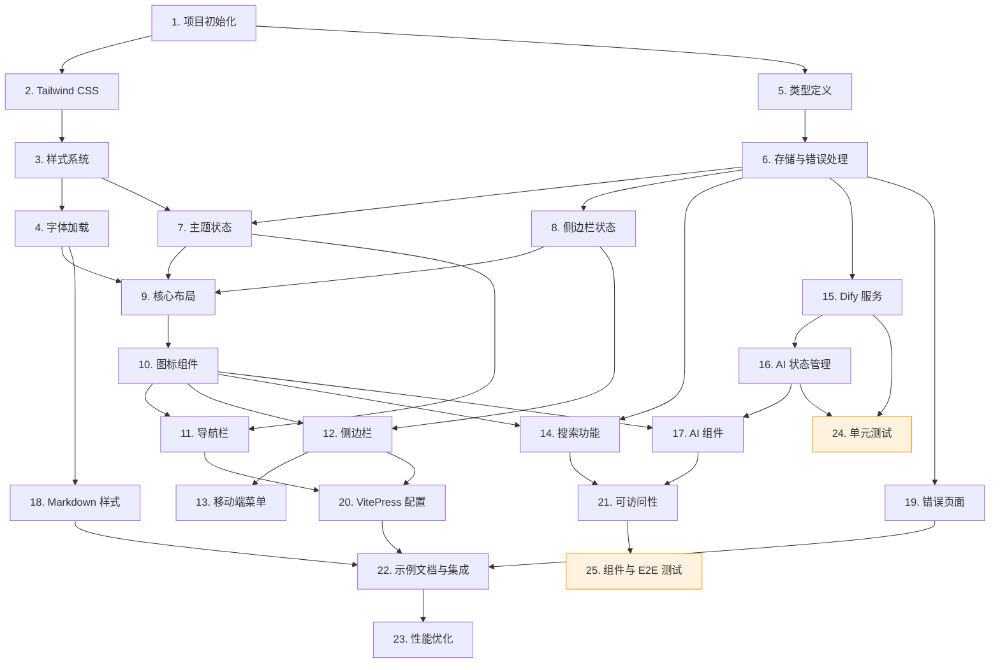

# Cursor 文档平台实现任务清单

本文档将 Cursor 文档平台的设计转换为一系列可执行的编码任务，确保每一步都可验证且增量进行。

---

## 实现计划

- [x] 1. 项目初始化与基础配置
  - 使用 pnpm 初始化项目，安装 VitePress、Vue 3、TypeScript
  - 创建完整目录结构：`docs/.vitepress/theme/{components,composables,services,styles,types}`
  - 创建 `tsconfig.json` 启用严格模式，配置路径别名
  - 创建 `package.json` 开发脚本（docs:dev、docs:build、docs:preview）
  - 验收标准：运行 `pnpm docs:dev` 能够启动开发服务器
  - _需求: 15.1, 15.2_

- [x] 2. 配置 Tailwind CSS
  - 安装 Tailwind CSS v4 及相关依赖
  - 创建 Tailwind 配置，设置 content 路径
  - 集成到 VitePress 构建流程
  - 验收标准：Tailwind 工具类在组件中生效
  - _需求: 设计文档技术选型_

- [x] 3. 样式系统与 CSS 变量
  - 创建 `styles/vars.css`：颜色、尺寸、字体、间距、圆角、阴影、过渡、z-index 变量
  - 实现深色模式 CSS 变量（`.dark` 类）
  - 创建 `styles/base.css`：全局重置、基础字体、焦点样式
  - 创建 `styles/transitions.css`：主题切换、侧边栏、模态框过渡动画
  - _需求: 7.5, 11.1-11.8_

- [x] 4. 字体加载配置
  - 下载 Inter 和 JetBrains Mono 字体（woff2 格式）到 `public/fonts/` 请先查看是否存在
  - 在 `base.css` 中定义 @font-face 规则
  - 配置字体预加载
  - 验收标准：页面使用自定义字体渲染
  - _需求: 10.1-10.7_

- [x] 5. 类型定义
  - 创建 `types/index.ts`：配置类型、导航类型、AI 问答类型、搜索类型、主题类型、布局类型、存储类型
  - 定义 StorageKey 枚举、ChatMessage、SidebarItem 等核心接口
  - _需求: 非功能性需求 - 可维护性_

- [x] 6. 存储服务与错误处理
  - 创建 `services/storage.ts`：localStorage 封装（get/set/remove），含错误处理
  - 创建 `composables/useStorage.ts`：响应式存储 API
  - 创建错误类型和 AppError 类
  - _需求: 4.6-4.7, 6.6-6.7, 7.2-7.3, 14.6_

- [x] 7. 主题状态管理
  - 创建 `composables/useTheme.ts`
  - 实现主题偏好状态、系统主题检测、isDark 计算属性
  - 实现 toggleTheme/setTheme 方法、DOM 更新
  - 集成 localStorage 持久化
  - _需求: 7.1-7.7_

- [x] 8. 侧边栏状态管理
  - 创建 `composables/useSidebar.ts`
  - 实现宽度状态（200-400px 范围限制）、移动端开关
  - 实现拖拽逻辑（鼠标+触摸事件）
  - 集成 localStorage 持久化
  - _需求: 4.1-4.8_

- [x] 9. 核心布局组件
  - 创建 `theme/index.ts`：主题入口，导入样式
  - 创建 `styles/layout.css`：三栏布局样式、响应式断点
  - 创建 `Layout.vue`：集成 useTheme/useSidebar，管理全局状态
  - 验收标准：页面显示基础三栏布局
  - _需求: 1.1-1.6, 8.1-8.7_

- [x] 10. 图标组件
  - 创建 `components/icons/` 目录
  - 实现 MenuIcon、SearchIcon、SunIcon、MoonIcon、CloseIcon、ChevronIcon、SendIcon、TrashIcon
  - 使用 SVG，支持 currentColor
  - _需求: 设计文档 - 组件层级关系_

- [x] 11. 导航栏组件
  - 创建 `ThemeToggle.vue`：主题切换按钮
  - 创建 `LangSwitch.vue`：语言切换下拉菜单
  - 创建 `NavBar.vue`：Logo、主导航、搜索按钮、主题切换、登录按钮
  - 验收标准：导航栏在不同屏幕尺寸下正确显示
  - _需求: 2.1-2.8, 16.2-16.6_

- [x] 12. 侧边栏组件
  - 创建 `SideBarItem.vue`：递归渲染目录项，折叠展开，路由高亮
  - 创建 `SideBar.vue`：目录结构渲染、拖拽手柄、移动端遮罩
  - 验收标准：侧边栏可拖拽调整宽度
  - _需求: 3.1-3.7, 4.1-4.8_

- [x] 13. 移动端菜单
  - 创建 `MobileMenu.vue`：抽屉式侧边栏
  - 实现从左侧滑入动画、遮罩层点击关闭
  - 验收标准：移动端抽屉正常工作
  - _需求: 1.4, 1.5, 8.2_

- [x] 14. 搜索功能
  - 创建 `composables/useSearch.ts`：搜索状态、⌘K/Ctrl+K 快捷键
  - 创建 `SearchModal.vue`：全屏模态框、自动聚焦、VitePress 本地搜索集成
  - 实现键盘导航（↑↓/Enter/ESC）
  - 验收标准：按 ⌘K 打开搜索，可搜索并跳转
  - _需求: 5.1-5.10, 8.6_

- [x] 15. Dify API 服务
  - 创建 `services/dify.ts`：DifyService 类
  - 实现 SSE 流式响应解析（ReadableStream + AsyncGenerator）
  - 实现 abort 方法取消请求
  - _需求: 6.3, 6.4, 6.11_

- [x] 16. AI 问答状态管理
  - 创建 `composables/useAIChat.ts`
  - 实现消息列表、对话 ID、加载/错误状态
  - 实现 sendMessage、历史记录持久化
  - 实现 ⌘I/Ctrl+I 快捷键
  - _需求: 6.1-6.12_

- [x] 17. AI 问答组件
  - 创建 `AIChatMessage.vue`：用户/AI 消息样式、Markdown 渲染
  - 创建 `AIChat.vue`：右侧滑入面板、消息列表、输入区域、清空历史
  - 验收标准：按 ⌘I 打开 AI 面板，可发送问题并收到流式回答
  - _需求: 6.1-6.12, 8.5_

- [x] 18. Markdown 内容样式
  - 创建 `styles/markdown.css`：标题、正文、代码块、链接、列表、表格、图片样式
  - 创建 `styles/components.css`：navbar、sidebar、search、ai-chat 组件样式
  - _需求: 9.1-9.9, 10.4-10.6_

- [x] 19. 错误页面
  - 创建 `NotFound.vue`：404 错误页面，返回首页链接
  - 创建 `ErrorBoundary.vue`：错误捕获、友好提示、重试按钮
  - _需求: 14.3-14.5_

- [x] 20. VitePress 配置完善
  - 完善 `config.ts`：多语言 locales（中/英/日）、导航栏 nav、侧边栏 sidebar
  - 配置本地搜索、Markdown 主题、head 标签
  - 创建 `.env.example`：VITE_DIFY_API_BASE、VITE_DIFY_API_KEY
  - _需求: 15.1-15.6, 16.8_

- [x] 21. 可访问性完善
  - 为所有交互元素添加 aria-label、alt 属性
  - 使用语义化 HTML 标签（nav、main、article、aside、button）
  - 实现焦点管理和焦点指示器
  - 确保键盘导航支持
  - _需求: 13.1-13.7_

- [x] 22. 示例文档与集成测试
  - 创建示例文档：首页、入门指南、功能介绍
  - 集成所有组件到 Layout，测试完整功能
  - 验收标准：所有功能正常工作
  - _需求: 设计文档 - 目录结构_

- [ ] 23. 性能优化
  - 配置 Vite 构建优化：代码分割、懒加载、压缩
  - 资源预加载：字体预加载、关键 CSS 内联
  - 图片懒加载实现
  - 验收标准：首屏渲染 < 3s，页面切换 < 1s
  - _需求: 12.1-12.7_

- [ ]* 24. 单元测试
  - Composables 测试：useTheme、useSidebar、useSearch、useAIChat
  - 服务层测试：DifyService、StorageService
  - _需求: 非功能性需求 - 可维护性_

- [ ]* 25. 组件与 E2E 测试
  - 组件测试：ThemeToggle、SearchModal、SideBar、AIChat
  - E2E 测试：页面导航、搜索、主题切换、AI 问答
  - _需求: 非功能性需求 - 可维护性_

---

## 任务依赖关系图

**图例说明:**
- 橙色边框：可选任务（测试）

---

## 任务优先级说明

| 优先级 | 说明 | 任务 |
|--------|------|------|
| P0 | 核心功能，必须完成 | 1-13, 18, 20 |
| P1 | 重要功能，应该完成 | 14-17, 19, 21-23 |
| P2 | 增强功能，可选 | 24, 25 |

---

**文档版本:** 2.0
**更新日期:** 2025-12-29
**语言:** 中文
